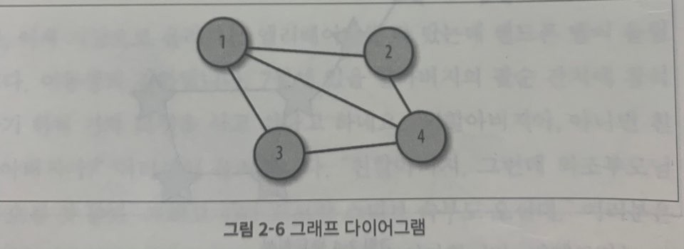
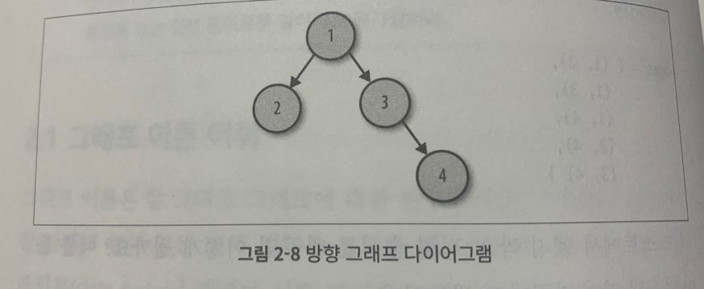
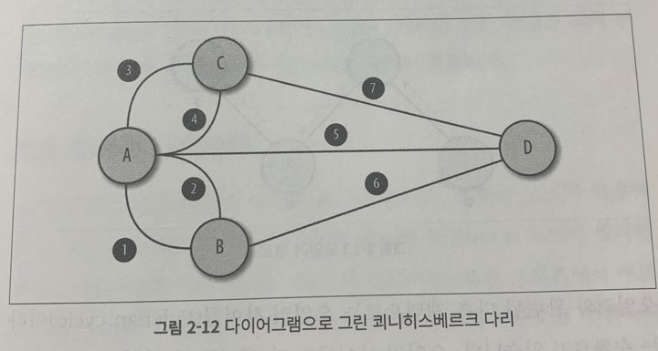
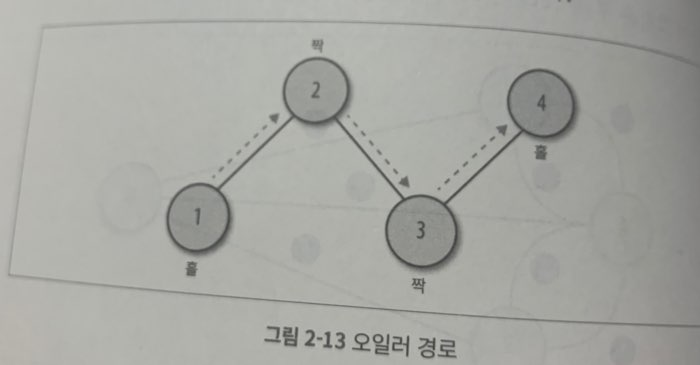
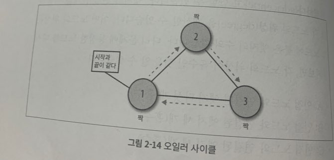

## 2장 그래프 이론

### 2.1 그래프 이론 어휘

그래프 이론은 말 그대로 그래프에 대한 연구이다. 

이 그래프 다이어그램은 데이터 포인트를 나타내는 원 네개로 이루어져 있다. 그래프 용어로 이들 점은 **노드**(nodes) 혹은 **정점**(vertex) 이라고 부른다. 노드 사이의 연결선은 **엣지**(edge)라고 한다. 위 그래프에는 다섯 개의 엣지가 있다.

그랲프를 방정식으로 표현하면 `G = (V, E)` 이다.

G는 그래프를 뜻한다.

V는 노드의 집합을 뜻한다. 

`vertices = {1, 2, 3, 4}`

E는 엣지의 집합을 나타낸다. 노드를 쌍으로 묶어 엣지를 나타낼 수 있다.

`edges = { {1, 2}, {1, 3}, {1, 4}, {2, 4}, {3, 4}}`

노드 사이에 방향이나 위계성이 없는 그래프를 **무방향 그래프** (undirected graph) 라고 한다. 앞에서 식으로 정의 내린 엣지는 데이터 포인트 사이의 관계를 나타내며 **비정렬 쌍**(unordered pairs) 라고 한다. 무방향 그래프는 비선형 데이터 구조이다. 

또 다른 그래프도 있다. 바로 **방향 그래프**(directed graph 혹은 digraph) 이다.

무방향 그래프와 비교했을 때, 노드의 수는 동일하지만 엣지가 다르게 생겼다. 이 그래프에는 노드 사이의 방향이 존재한다. 

`vertices = {1, 2, 3, 4}`

`edges = ( {1, 2}, {1, 3} {4, 4})`

`graph = ( {1, 2, 3, 4}, ({1, 2}, {1, 3}, {3, 4}) )`

소괄호는 엣지 쌍이 ''순서를 가지고 있음''을 의미한다. 엣지 쌍에 순서가 부여되어 있다면, 그 그래프는 방향 그래프이다. 방향 그래프의 엣지 쌍을 다시 정렬하면 다른 그래프가 완성된다.

### 2.2 그래프 이론의 역사

위 그림에서 A와 B는 하나의 엣지로 연결되어 있기 떄문에 서로 **인접하다**(adjacent) 라고 말할 수 있다.엣지의 연결 관계를 이용하면 각 노드의 **위상**(degree)을 계산할 수 있다. 

각 엣지를 한 번씩 거쳐 가는 그래프를 **오일러 경로**(Eulerian path)라고 부른다. (수학자 오일러가 그래프를 통해 쾨니히스베르크 다리를 한번씩 거쳐가는 경로를 찾는 일에서 착안)

오일러 경로인 방향 그래프는 위상이 홀수인 노드가 두 개이거나, 모든 노드의 위상이 짝수이다.

오일러와 관련된 다른 개념으로는 **오일러 사이클**(Eulerian cycle)이 있다. 오일러 사이클도 각 엣지를 한 번씩만 거치지만, 시작 노드와 끝 노드가 같다.

### 2.3 트리는 그래프다.

트리는 노드가 위계적으로 정렬된 그래프이다. 루트 노드가 있다면, 트리 그래프 일 것이다.

어떤 그래프가 트리 구조인지 알아보려면 그 그래프의 루트 노드(시작 노드)를 살펴보면 된다. 루트 노드부터 살펴보면, 트리 구조에서는 엣지를 사용해 루트 노드와 자식 노드를 연결한다. 자식을 가지고 있는 노드는 부모 노드라고 부르며 자식 노드 아래에 여러 개의 자식 노드가 연결되어 있다면, 그 노드는 가지(branch)라고 부른다. 자식이 없는 노드는 잎(leaf) 이라고 부른다.

트리의 노드는 모두 데이터 포인트를 보유하고 있다. 그래서 특정 데이터에 빠르게 접근하기 위해서는 각 노드의 **깊이**(depth) 를 계산해야 한다. 노드의 깊이는 쉽게 말해 루트 노드에서 얼마나 멀리 떨어져 있는지를 나타내는 것이다. 

트리 안에 트리가 존재할 수 있다. 트리 안에 위치한 트리를 서브 트리(subtree)라고 한다. 

**이진 트리**(binary tree) 는 자식 노드가 최대 두개 뿐인 트리이다. 주로 **이진 탐색 트리**(binary search tree) 를 일컬어 이진 트리라고 한다.

